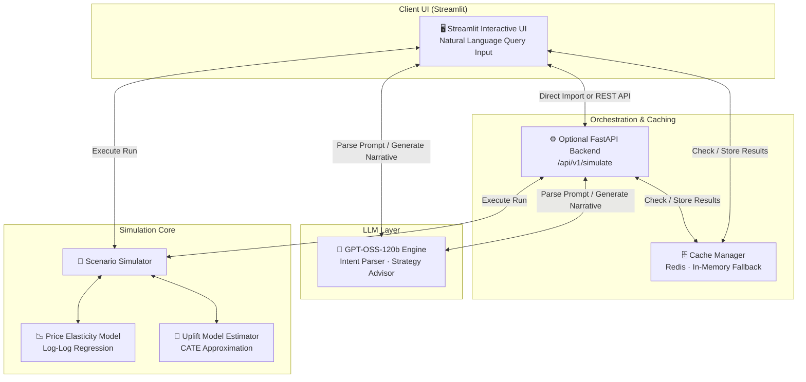
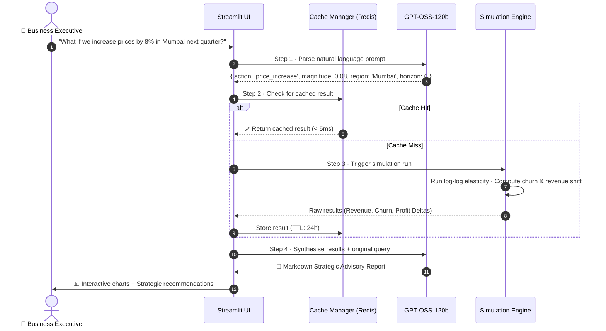

<div align="center">

<br/>

# 🔮 BizSim-AI

### AI-Powered Business Experimentation & Decision Simulator

<br/>

[](https://www.python.org/)
[](https://streamlit.io)
[](https://fastapi.tiangolo.com)
[](https://redis.io)
[](LICENSE)

<br/>

> *"What happens to our revenue and customer churn if we increase prices by 8% in Mumbai next quarter?"*

**BizSim-AI** combines **causal inference**, **econometric modeling**, and **Generative AI** to answer critical counterfactual business questions — *before* you commit capital.

Unlike dashboards that report what already happened, BizSim-AI lets you simulate what *will* happen under different decisions, then generates an executive-ready advisory report — all from a single natural language question.

<br/>

[**Quick Start**](#-setup--running) · [**Architecture**](#-system-architecture) · [**Data Science**](#-data-science--causal-core) · [**Design Decisions**](#-design-decisions--honest-limitations) · [**Tech Stack**](#%EF%B8%8F-tech-stack)

<br/>

</div>

---

## ✨ What Makes This Different

Most analytics tools look *backward* at historical data. BizSim-AI lets executives, product managers, and growth analysts simulate **future states** in real time — answering "what if" before committing capital.

| Capability | Description |
|---|---|
| 🧠 **Natural Language Interface** | Type a business question; the LLM parses intent into a structured simulation — no forms, no dropdowns |
| 📊 **Causal Econometrics** | Log-log price elasticity and CATE uplift modeling — not just surface-level correlations |
| ⚡ **Intelligent Caching** | Redis-backed simulation cache with graceful in-memory fallback; zero cold-start penalty |
| 📝 **Executive Narrative Reports** | AI synthesises raw simulation numbers into a professional Markdown advisory report |
| 🔌 **Dual Run Modes** | Standalone Streamlit for demos *or* full decoupled FastAPI + Redis for production-style deployment |
| 🧪 **Transparent Synthetic Data** | Datasets are procedurally generated with documented causal rules — no black-box magic |

---

## 🎨 System Architecture

BizSim-AI supports two deployment modes:

- **Standalone Mode** — runs entirely within Streamlit; ideal for quick demos and Streamlit Sharing
- **Client-Server Mode** — decoupled FastAPI backend with Redis caching, demonstrating REST API design and high-performance serialization



### 🔄 The Executive Query Lifecycle



---

## 🧠 Data Science & Causal Core

The simulator models counterfactuals using solid econometric principles.

### 1 · Price Elasticity of Demand (PED)

Volume contraction from price changes is estimated via a **log-log demand regression**:

$$\ln(\text{demand}) = \alpha + \beta \ln(\text{price}) + \gamma X + \varepsilon$$

Where $\beta$ is the **Price Elasticity of Demand** coefficient. The elasticity values below are calibrated from published Indian e-commerce and FMCG research and embedded into the synthetic data generator — they are intentional design parameters, not learned from proprietary data:

| City | β (PED) | Calibration Rationale | Effect of an 8% Price Increase |
|---|---|---|---|
| 🟠 Mumbai | −1.4 | Mid-range elastic; urban premium segment | −11.2% volume drop |
| 🟢 Delhi | −1.2 | More inelastic; higher brand loyalty observed | −9.6% volume drop |
| 🔴 Bangalore | −1.6 | Highly price-sensitive; tech-savvy comparison shoppers | −12.8% volume drop |

> **Note:** These coefficients are the simulation's ground truth — the synthetic generator encodes them as hidden causal rules, and the model's job is to surface them through the log-log regression. The R² > 0.80 target validates how cleanly the regression recovers those rules from noisy synthetic data.

### 2 · Uplift Modeling & Churn (CATE)

For discount campaigns, the simulator estimates **Conditional Average Treatment Effects** at the customer segment level:

$$\tau(x) = \mathbb{E}[Y(1) - Y(0) \mid X=x]$$

Customer cohorts are segmented into four groups — a more realistic framing than the classic two-group split:

| Segment | Behaviour | Simulation Treatment |
|---|---|---|
| ✅ **Persuadables** | Churn probability drops significantly with a discount | High-priority targeting |
| 😐 **Sure Things** | Would have stayed regardless — discount is wasted spend | Deprioritised |
| 🚫 **Lost Causes** | Won't stay even with a discount | Excluded from campaign |
| ⚠️ **Do-Not-Disturbs** | Premium users annoyed by promotional outreach; churn risk *increases* | Actively suppressed |

The Qini coefficient (target > 0.15) measures how well the model separates Persuadables from the other three groups. A random targeting strategy scores 0; a perfect model scores 1.

---

## ⚡ Caching Strategy

Simulations and LLM narrative generations are computationally expensive. BizSim-AI implements a **deterministic, tiered caching strategy**:

```
Request Parameters  →  MD5 Hash  →  Cache Key: sim:hash:<hash>
                                          ↓
                              ┌─── Redis (TTL: 24h) ───┐
                              │  if running locally     │
                              │  or via Docker          │
                              └─────────────────────────┘
                                          ↓ graceful fallback
                              ┌─── Streamlit In-Memory ──┐
                              │  @st.cache_data           │
                              │  Zero-setup, always on   │
                              └──────────────────────────┘
```

The MD5 hash ensures identical query parameters always hit the same cache slot — even across sessions. If Redis is unavailable, the app degrades silently to in-memory caching with no user-facing impact.

---

## 🔮 LLM Orchestration

The LLM is used at two distinct points in the pipeline, each with a tightly scoped prompt to minimise hallucination:

**① Intent Parser** — converts a natural language business question into a validated JSON object with strict enum constraints on `action`, `region`, and `horizon_months`. The model cannot invent parameters outside the allowed schema.

**② Strategic Advisor** — receives the *raw simulation output* (numbers, deltas, confidence intervals) and writes a professional executive advisory report. The LLM interprets data it didn't generate — separating the analytical and narrative roles cleanly.

This two-stage design means the simulation math is never delegated to the LLM. Numbers come from the econometric engine; language comes from the model.

> **Mock Mode:** If no API key is configured, both stages fall back to deterministic heuristic templates — allowing full end-to-end testing with zero external dependencies.

---

## 📈 Evaluation Metrics

| Model | Metric | Target | What It Validates |
|---|---|---|---|
| **Price Elasticity** | R² | > 0.80 | Regression cleanly recovers embedded causal rules from synthetic noise |
| **Causal Impact** | MAPE | < 10.0% | Synthetic control group tracks counterfactual baseline accurately |
| **Uplift Model** | Qini Coefficient | > 0.15 | Model successfully separates Persuadables from Do-Not-Disturbs and Lost Causes |

---

## 🏗️ Design Decisions & Honest Limitations

This section documents intentional trade-offs — useful context for technical reviewers and collaborators.

**Hardcoded elasticity coefficients are a feature, not a shortcut.**
The PED values (Mumbai −1.4, Delhi −1.2, Bangalore −1.6) are design parameters embedded in the synthetic data generator. The regression model's job is to *recover* these known values. This creates a closed-loop validation environment: if R² drops below 0.80, it flags a data generation or modelling bug — not a real-world surprise.

**Synthetic data means results are illustrative, not predictive.**
There is no proprietary sales data behind this simulator. The output of any given simulation is only as good as the calibration assumptions. For a real deployment, elasticity coefficients would need to be estimated from historical transaction data using proper causal identification (DiD, IV, or RDD).

**CATE is approximated, not identified.**
The uplift model estimates treatment heterogeneity using customer attributes but does not use a randomised experiment. In a production setting, proper CATE estimation requires either A/B test data or strong assumptions about selection into treatment.

**The LLM narrative is not financial advice.**
The AI-generated advisory report is a communication layer over simulation output. It should be reviewed by a domain expert before informing any real capital allocation decision.

---

## 🛠️ Tech Stack

| Layer | Technology |
|---|---|
| **Frontend** | Streamlit · Plotly · Custom HSL Styling |
| **API Backend** | FastAPI · Uvicorn · Pydantic |
| **Data & Analytics** | Pandas · NumPy |
| **Caching** | Redis · Python dict fallback |
| **LLM Orchestration** | GPT-OSS-120b (OpenAI-compatible API) |

---

## 📁 Project Structure

```
ai-business-simulator/
│
├── 📄 docker-compose.yml          # Optional: Redis container setup
├── 📄 requirements.txt            # Python dependencies
├── 📄 .env.example                # Configuration template (LLM & Redis)
│
├── 📂 data/
│   └── synthetic/                 # Generated sales & customer CRM datasets
│
└── 📂 src/
    ├── 📂 data/
    │   └── synthetic_generator.py # Procedural dataset generator with embedded causal rules
    │
    ├── 📂 models/
    │   └── scenario_simulator.py  # Econometric & simulation math engine
    │
    ├── 📂 genai/
    │   └── llm_client.py          # GPT-OSS-120b client (with mock fallback)
    │
    ├── 📂 utils/
    │   └── cache_manager.py       # Redis + in-memory fallback logic
    │
    └── 📂 app/
        └── streamlit_app.py       # Main unified Streamlit dashboard
```

---

## 🚀 Setup & Running

### Step 1 — Clone & Install

```bash
git clone https://github.com/your-username/ai-business-simulator.git
cd ai-business-simulator
pip install -r requirements.txt
```

### Step 2 — Configure Environment

Copy `.env.example` to `.env` and fill in your credentials:

```env
# GPT-OSS-120b API (OpenAI-compatible)
LLM_API_URL=https://api.gpt-oss-120b.example.com/v1
LLM_API_KEY=your_api_key_here

# Redis (optional — defaults to localhost)
REDIS_HOST=localhost
REDIS_PORT=6379
```

> **No API key?** The app automatically runs in **Mock LLM Mode** using deterministic template rules — full end-to-end functionality, no external dependencies.

### Step 3 — Run

**Option A · Standalone (Single Command)**

```bash
streamlit run app/streamlit_app.py
```

The app auto-checks for datasets, runs the synthetic generator if missing, and launches the UI.

**Option B · Client-Server (Full API + Redis)**

```bash
# 1. Start Redis
docker-compose up -d redis

# 2. Start FastAPI backend
uvicorn src.api.main:app --host 0.0.0.0 --port 8000

# 3. Start Streamlit dashboard
streamlit run app/streamlit_app.py -- --use-api
```

---

## 🗺️ Roadmap

Potential extensions for contributors or future versions:

- [ ] **Real data adapter** — plug in actual transaction CSVs to estimate elasticity from historical data
- [ ] **Sensitivity analysis** — show how results shift across a range of elasticity assumptions
- [ ] **Multi-variable scenarios** — combine price change + discount campaign in a single simulation
- [ ] **Export to PDF** — one-click executive report export
- [ ] **A/B test mode** — simulate a held-out experiment design before running it live

---

<div align="center">

<br/>

*A portfolio project demonstrating causal econometrics, LLM orchestration, and production-style Python architecture.*

*Built with intentional trade-offs, documented honestly.*

<br/>

**[⬆ Back to top](#-bizsim-ai)**

</div>
