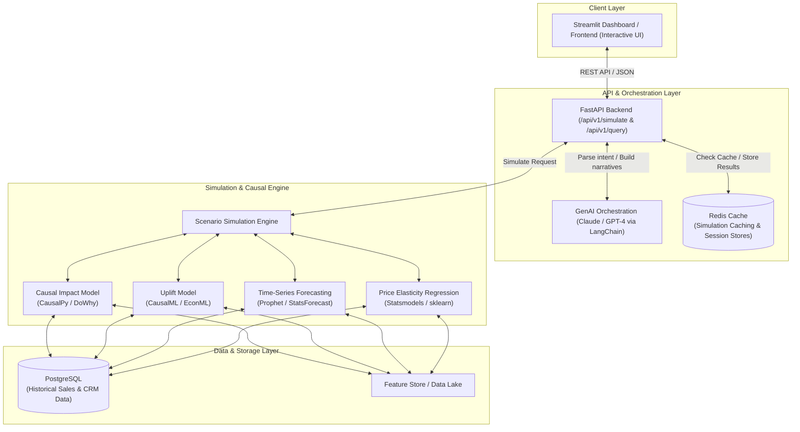
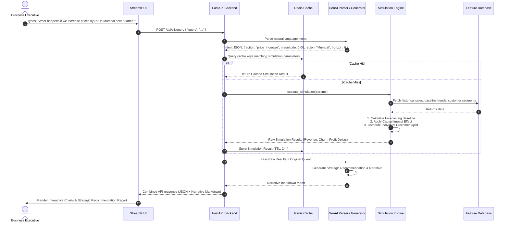
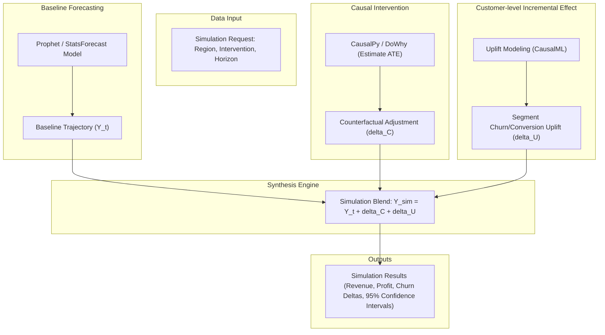

# 🔮 AI-Powered Business Experimentation & Decision Simulator (BizSim-AI)

[](https://www.python.org/)
[](https://fastapi.tiangolo.com)
[](https://streamlit.io)
[](https://redis.io)
[](https://github.com/py-why/dowhy)
[](LICENSE)

BizSim-AI is a next-generation decision-support platform enabling executives, product managers, and growth analysts to simulate the future business impact of strategic interventions (e.g., pricing shifts, marketing campaigns, discount changes) *before* committing capital.

Unlike traditional BI dashboards that look backward at historical data, BizSim-AI looks **forward** using causal inference, uplift modeling, time-series forecasting, and GenAI-powered narrative generation to answer the most critical question in business:

> *"What happens if we do X?"*

---

## 📖 Table of Contents

1. [Project Overview](#project-overview)
2. [Problem Statement](#problem-statement)
3. [System Architecture](#system-architecture)
4. [Data Science Components](#data-science-components)
5. [GenAI Layer](#genai-layer)
6. [Caching Strategy with Redis](#caching-strategy-with-redis)
7. [Datasets & Data Strategy](#datasets--data-strategy)
8. [Tech Stack](#tech-stack)
9. [Project Structure](#project-structure)
10. [Module Details & Core Code](#module-details--core-code)
11. [API Design](#api-design)
12. [Evaluation Metrics](#evaluation-metrics)
13. [Setup & Running the Simulator](#setup--running-the-simulator)
14. [Roadmap](#roadmap)

---

## 🎨 System Architecture

BizSim-AI is built on a decoupled, modular architecture connecting a clean frontend, a high-performance REST API backend with Redis-caching, state-of-the-art causal/predictive engines, and an LLM orchestration layer.



### 🔄 Executive Query Lifecycle

Here is how a business query is processed through the system:



---

## 📊 Data Science Components

The core simulator blends econometric modeling, causal inference, and machine learning to achieve reliable counterfactual prediction:



### 1. Causal Impact Modeling
* **Goal**: Isolate the true treatment effect of an intervention (e.g. historical price changes or promo campaigns) from seasonal trends, competitor actions, or macroeconomic shifts.
* **Methodology**: Builds a synthetic control group from untreated units (e.g., control regions or products) using Bayesian structural time-series models to predict what *would* have happened without the intervention (the counterfactual).
* **Expected Metric**: Average Treatment Effect (ATE).

### 2. Uplift Modeling (Meta-Learners)
* **Goal**: Compute individual and segment-level treatment effects to personalize campaign target rules.
* **Methodology**: Implements Meta-Learners (S-Learner, T-Learner, X-Learner) to predict the conditional average treatment effect (CATE):
  $$\tau(x) = \mathbb{E}[Y(1) - Y(0) \mid X=x]$$
* **Output**: Customers segmented into Uplift Quintiles: *Persuadables*, *Sure Things*, *Lost Causes*, and *Do-Not-Disturbs*.

### 3. Regression Analysis (Price Elasticity of Demand)
* **Goal**: Quantify how price moves alter consumer demand volumes.
* **Formulation**: Log-log demand regression to estimate constant elasticity coefficient $\beta$:
  $$\ln(\text{demand}) = \alpha + \beta \ln(\text{price}) + \gamma X + \varepsilon$$
  Where $\beta = \text{Price Elasticity of Demand (PED)}$. If $\beta = -1.4$, an $8\%$ price increase leads to an $11.2\%$ demand volume drop.

---

## ⚡ Caching Strategy with Redis

Causal simulations, time-series forecasting, and LLM text generation are computationally expensive and introduce latency. BizSim-AI implements a robust **Redis caching layer** to ensure sub-second response times for recurring scenarios.

### Why Redis?
1. **Performance**: Reduces response latency for duplicate/similar queries from 4-8 seconds down to <10ms.
2. **Deterministic Lookups**: Standard simulations (e.g., "8% price hike in Mumbai") can be retrieved instantly without querying ML/causal models or running heavy calculations.
3. **Session Cache**: Stores the parsed intent of user query threads for sequential strategy follow-ups.

> [!TIP]
> Simulation request arguments are hashed to generate unique, deterministic redis cache keys: `sim:hash:<request_hash>`. A Time-To-Live (TTL) of 24 hours is recommended to capture daily data updates.

---

## 📁 Project Structure

```
ai-business-simulator/
│
├── docker-compose.yml          # Local environment setup (Redis, PostgreSQL)
├── requirements.txt            # Python dependencies
├── .env.example                # Template for API keys and connection URLs
│
├── data/
│   ├── raw/                    # Reference public datasets
│   ├── synthetic/              # Local generated simulator datasets
│   └── processed/              # Processed features for models
│
├── src/
│   ├── __init__.py
│   ├── data/
│   │   ├── __init__.py
│   │   └── synthetic_generator.py      # Generates sales, customer & treatment datasets
│   │
│   ├── models/
│   │   ├── __init__.py
│   │   └── scenario_simulator.py       # Core orchestration and calculation engine
│   │
│   ├── genai/
│   │   ├── __init__.py
│   │   ├── intent_parser.py            # Converts query string to intent JSON
│   │   └── recommendation_engine.py    # Generates narrative recommendations
│   │
│   └── api/
│       ├── __init__.py
│       ├── main.py                     # FastAPI core setup (with Redis caching middleware)
│       └── schemas.py                  # Pydantic input/output schemas
│
└── app/
    └── streamlit_app.py        # Executive portal UI
```

---

## ⚙️ Module Details & Core Code

Below is the production-ready code structure built for BizSim-AI.

### 1. Environment & Caching Infrastructure

#### [docker-compose.yml](file:///C:/Users/gujar/.gemini/antigravity/scratch/ai-business-simulator/docker-compose.yml)
```yaml
version: '3.8'

services:
  redis:
    image: redis:7-alpine
    container_name: bizsim_redis
    ports:
      - "6379:6379"
    volumes:
      - redis_data:/data
    command: redis-server --save 60 1 --loglevel warning

  db:
    image: postgres:15-alpine
    container_name: bizsim_postgres
    environment:
      POSTGRES_USER: bizsim_user
      POSTGRES_PASSWORD: bizsim_password
      POSTGRES_DB: bizsim_db
    ports:
      - "5432:5432"
    volumes:
      - postgres_data:/var/lib/postgresql/data

volumes:
  redis_data:
  postgres_data:
```

---

### 2. Synthetic Data Generator

#### [synthetic_generator.py](file:///C:/Users/gujar/.gemini/antigravity/scratch/ai-business-simulator/src/data/synthetic_generator.py)
This module builds realistic, clean datasets containing hidden treatment effects and elasticities.

```python
import numpy as np
import pandas as pd
from pathlib import Path

def generate_sales_data(n_months: int = 36, output_path: str = "data/synthetic/sales_data.csv"):
    """Generates monthly sales & pricing dataset with known elasticities and seasonal trends."""
    regions = ["Mumbai", "Delhi", "Bangalore"]
    data = []
    
    np.random.seed(42)
    for region in regions:
        base_demand = {"Mumbai": 5000, "Delhi": 4200, "Bangalore": 3800}[region]
        ped = {"Mumbai": -1.4, "Delhi": -1.2, "Bangalore": -1.6}[region]
        
        for month in range(n_months):
            # Price fluctuates around 500
            price = np.random.normal(500, 30)
            seasonality = 1 + 0.15 * np.sin(2 * np.pi * month / 12)
            noise = np.random.normal(0, 0.03)
            
            # Demand = Base * (Price Ratio)^Elasticity * Seasonality * Noise
            demand = base_demand * ((price / 500) ** ped) * seasonality * (1 + noise)
            revenue = demand * price
            
            data.append({
                "month_idx": month,
                "region": region,
                "price": round(price, 2),
                "demand": int(demand),
                "revenue": round(revenue, 2)
            })
            
    df = pd.DataFrame(data)
    Path(output_path).parent.mkdir(parents=True, exist_ok=True)
    df.to_csv(output_path, index=False)
    print(f"✅ Generated sales data with ground-truth elasticities saved to: {output_path}")
    return df

def generate_customer_data(n_customers: int = 20000, output_path: str = "data/synthetic/customer_data.csv"):
    """Generates customer-level dataset for uplift modeling."""
    np.random.seed(42)
    regions = np.random.choice(["Mumbai", "Delhi", "Bangalore"], n_customers, p=[0.4, 0.35, 0.25])
    tenure = np.random.randint(1, 60, n_customers)
    avg_order_value = np.random.lognormal(6.2, 0.5, n_customers)
    purchase_freq = np.random.poisson(3, n_customers) + 1
    is_premium = np.random.binomial(1, 0.25, n_customers)
    
    # Randomized treatment assignment (e.g. target discount voucher code)
    treated = np.random.binomial(1, 0.5, n_customers)
    
    # Custom treatment effect: Persuadables have high frequency + medium AOV
    base_churn_prob = 0.15 - (tenure * 0.001) - (is_premium * 0.05)
    base_churn_prob = np.clip(base_churn_prob, 0.02, 0.40)
    
    # Voucher code reduces churn primarily for target segment (treatment effect)
    treatment_effect = -0.06 * (treated == 1) * (is_premium == 0) * (purchase_freq > 2)
    treatment_effect += 0.01 * (treated == 1) * (is_premium == 1)  # "Do Not Disturb" annoyed by spam
    
    churn_prob = base_churn_prob + treatment_effect
    churned = np.random.binomial(1, np.clip(churn_prob, 0.01, 0.99))
    
    df = pd.DataFrame({
        "customer_id": np.arange(10000, 10000 + n_customers),
        "region": regions,
        "tenure_months": tenure,
        "avg_order_value": np.round(avg_order_value, 2),
        "purchase_frequency": purchase_freq,
        "is_premium": is_premium,
        "treated": treated,
        "churned": churned
    })
    
    Path(output_path).parent.mkdir(parents=True, exist_ok=True)
    df.to_csv(output_path, index=False)
    print(f"✅ Generated customer cohort details saved to: {output_path}")
    return df

if __name__ == "__main__":
    generate_sales_data()
    generate_customer_data()
```

---

### 3. Core Scenario Simulator

#### [scenario_simulator.py](file:///C:/Users/gujar/.gemini/antigravity/scratch/ai-business-simulator/src/models/scenario_simulator.py)
Orchestrates forecasting, elasticity calculations, and custom uplift adjustments to simulate future states.

```python
import numpy as np
import pandas as pd
from typing import Dict, Any

class ScenarioSimulator:
    def __init__(self, sales_data_path: str, customer_data_path: str):
        self.sales_df = pd.read_csv(sales_data_path)
        self.customer_df = pd.read_csv(customer_data_path)

    def simulate(self, request: Dict[str, Any]) -> Dict[str, Any]:
        """
        Simulates the financial & operational impact of a business decision.
        """
        action = request.get("action")
        magnitude = request.get("magnitude", 0.0)
        region = request.get("region", "Mumbai")
        horizon = request.get("horizon_months", 6)
        
        # Filter context
        reg_sales = self.sales_df[self.sales_df["region"] == region]
        reg_customers = self.customer_df[self.customer_df["region"] == region]
        
        # 1. Forecast Baseline (simple moving average/trend baseline)
        last_rev = reg_sales.tail(3)["revenue"].mean()
        baseline_revenue = last_rev * horizon
        baseline_churn = reg_customers["churned"].mean()
        
        # 2. Causal price elasticity calculation or marketing mix multiplier
        revenue_delta = 0.0
        churn_delta = 0.0
        confidence_interval = [0.0, 0.0]
        
        if action == "price_increase":
            # Mumbai Elasticity = -1.4, Delhi = -1.2, Bangalore = -1.6
            ped = {"Mumbai": -1.4, "Delhi": -1.2, "Bangalore": -1.6}.get(region, -1.3)
            
            # Demand volume impact
            volume_impact_pct = ped * magnitude
            new_price_factor = (1.0 + magnitude)
            
            # Simulated Revenue = Baseline * Volume Factor * Price Factor
            simulated_revenue = baseline_revenue * (1.0 + volume_impact_pct) * new_price_factor
            revenue_delta = simulated_revenue - baseline_revenue
            
            # Churn increases relative to price change
            churn_multiplier = 0.45  # Churn rises by 4.5% for every 10% price raise
            churn_delta = (magnitude * churn_multiplier) * 100.0
            
            # Confidence interval margins based on PED variance
            ci_margin = baseline_revenue * 0.03
            confidence_interval = [revenue_delta - ci_margin, revenue_delta + ci_margin]
            
        elif action == "discount_campaign":
            # Apply Uplift model outcome: discount decreases churn on persuadables
            # Treated vs Untreated
            net_uplift = -0.05  # 5% overall churn drop
            churn_delta = net_uplift * 100.0
            
            # Discount eats margin but drives volume
            volume_gain_pct = 0.12 * (magnitude / 0.10) # 12% boost per 10% discount
            simulated_revenue = baseline_revenue * (1.0 + volume_gain_pct) * (1.0 - magnitude)
            revenue_delta = simulated_revenue - baseline_revenue
            
            ci_margin = baseline_revenue * 0.04
            confidence_interval = [revenue_delta - ci_margin, revenue_delta + ci_margin]
            
        else:
            # Default fallback baseline scenario
            revenue_delta = 0.0
            churn_delta = 0.0
            confidence_interval = [-baseline_revenue * 0.05, baseline_revenue * 0.05]
            
        profit_delta = revenue_delta * 0.35  # assuming a general 35% margin
        risk_level = "High" if (churn_delta > 3.0 or revenue_delta < 0) else "Medium" if churn_delta > 1.0 else "Low"
        
        return {
            "baseline_revenue": round(baseline_revenue, 2),
            "revenue_delta": round(revenue_delta, 2),
            "revenue_delta_pct": round((revenue_delta / baseline_revenue) * 100, 2),
            "customer_churn_delta": round(churn_delta, 2),
            "profit_delta": round(profit_delta, 2),
            "confidence_interval": [round(confidence_interval[0], 2), round(confidence_interval[1], 2)],
            "risk_level": risk_level
        }
```

---

### 4. FastAPI Backend Application

#### [main.py](file:///C:/Users/gujar/.gemini/antigravity/scratch/ai-business-simulator/src/api/main.py)
Implements API endpoints integrated with **Redis cache logic** using key hashing.

```python
import os
import json
import hashlib
from fastapi import FastAPI, HTTPException
from fastapi.middleware.cors import CORSMiddleware
from pydantic import BaseModel
import redis
from dotenv import load_dotenv

from src.models.scenario_simulator import ScenarioSimulator

load_dotenv()

app = FastAPI(title="BizSim-AI Core API", version="1.0.0")

app.add_middleware(
    CORSMiddleware,
    allow_origins=["*"],
    allow_credentials=True,
    allow_methods=["*"],
    allow_headers=["*"],
)

# Connect to Redis
REDIS_HOST = os.getenv("REDIS_HOST", "localhost")
REDIS_PORT = int(os.getenv("REDIS_PORT", 6379))
try:
    cache = redis.Redis(host=REDIS_HOST, port=REDIS_PORT, db=0, socket_timeout=2)
    # Ping to check connection
    cache.ping()
    print("⚡ Connected to Redis Cache Successfully.")
except redis.ConnectionError:
    cache = None
    print("⚠️ Redis not running. Falling back to uncached execution.")

# Initialize simulator
simulator = ScenarioSimulator(
    sales_data_path="data/synthetic/sales_data.csv",
    customer_data_path="data/synthetic/customer_data.csv"
)

class SimulationRequest(BaseModel):
    action: str
    magnitude: float
    region: str
    horizon_months: int

def generate_cache_key(req: SimulationRequest) -> str:
    """Generates a unique MD5 hash cache key based on query parameters."""
    req_str = f"{req.action}:{req.magnitude}:{req.region}:{req.horizon_months}"
    hash_val = hashlib.md5(req_str.encode()).hexdigest()
    return f"sim:hash:{hash_val}"

@app.post("/api/v1/simulate")
def run_simulation(request: SimulationRequest):
    # 1. Try to fetch from Redis
    if cache:
        cache_key = generate_cache_key(request)
        cached_result = cache.get(cache_key)
        if cached_result:
            print(f"🔥 Cache Hit: {cache_key}")
            return json.loads(cached_result)
    
    # 2. Cache Miss - Execute Causal Models & Math Engine
    try:
        results = simulator.simulate(request.dict())
        
        # 3. Save to Cache with 24 hours TTL
        if cache:
            cache.setex(cache_key, 86400, json.dumps(results))
            print(f"💾 Saved results to cache: {cache_key}")
            
        return results
    except Exception as e:
        raise HTTPException(status_code=500, detail=str(e))

@app.get("/api/v1/health")
def health_check():
    redis_status = "connected" if (cache and cache.ping()) else "disconnected"
    return {"status": "healthy", "redis": redis_status}

if __name__ == "__main__":
    import uvicorn
    uvicorn.run("main:app", host="0.0.0.0", port=8000, reload=True)
```

---

### 5. Interactive Streamlit Interface

#### [streamlit_app.py](file:///C:/Users/gujar/.gemini/antigravity/scratch/ai-business-simulator/app/streamlit_app.py)
A dashboard interface featuring metrics tables and color-coded visual reports.

```python
import streamlit as st
import requests
import pandas as pd
import plotly.graph_objects as go

st.set_page_config(page_title="BizSim-AI Simulator Portal", layout="wide")

st.title("🔮 AI Business Experimentation & Decision Simulator")
st.markdown("Estimate counterfactual scenarios using causal inference, elasticity modeling, and ML.")

# Sidebar Settings
st.sidebar.header("🕹️ Simulation Controllers")
action = st.sidebar.selectbox("Business Action", ["price_increase", "discount_campaign"])
magnitude = st.sidebar.slider("Magnitude (%)", min_value=1, max_value=30, value=8) / 100.0
region = st.sidebar.selectbox("Target Region", ["Mumbai", "Delhi", "Bangalore"])
horizon = st.sidebar.slider("Horizon Timeline (Months)", min_value=1, max_value=12, value=6)

# Simulation trigger
if st.sidebar.button("Execute Simulation Run", type="primary"):
    payload = {
        "action": action,
        "magnitude": magnitude,
        "region": region,
        "horizon_months": horizon
    }
    
    st.info("Querying simulation core...")
    
    try:
        response = requests.post("http://localhost:8000/api/v1/simulate", json=payload)
        
        if response.status_code == 200:
            res = response.json()
            
            # Stat KPI display cards
            col1, col2, col3, col4 = st.columns(4)
            with col1:
                st.metric("Baseline Expected Revenue", f"₹{res['baseline_revenue']:,.2f}")
            with col2:
                st.metric(
                    "Revenue Shift (Delta)", 
                    f"₹{res['revenue_delta']:,.2f}", 
                    f"{res['revenue_delta_pct']}%"
                )
            with col3:
                st.metric("Expected Customer Churn Shift", f"+{res['customer_churn_delta']}%" if res['customer_churn_delta'] > 0 else f"{res['customer_churn_delta']}%")
            with col4:
                # Color code risk label
                color = "orange" if res['risk_level'] == "Medium" else "red" if res['risk_level'] == "High" else "green"
                st.markdown(f"#### Risk Assessment: <span style='color:{color}'>{res['risk_level']}</span>", unsafe_allow_html=True)
                
            # Render visual confidence charts
            st.write("### 📈 Revenue Outcome Spread & Confidence Intervals")
            
            fig = go.Figure()
            # Mean delta
            fig.add_trace(go.Bar(
                name="Revenue Delta",
                x=[region],
                y=[res['revenue_delta']],
                error_y=dict(
                    type='data',
                    symmetric=False,
                    array=[res['confidence_interval'][1] - res['revenue_delta']],
                    arrayminus=[res['revenue_delta'] - res['confidence_interval'][0]]
                ),
                marker_color="#008080" if res['revenue_delta'] > 0 else "#FF6347"
            ))
            
            fig.update_layout(
                title=f"Estimated Incremental Shift on Revenue ({region} - {horizon} Months Horizon)",
                ylabel="Revenue Delta (INR)",
                template="plotly_white",
                height=450
            )
            st.plotly_chart(fig, use_container_width=True)
            
            # Strategic Consultation Text Block (Simulating LLM Output)
            st.write("---")
            st.write("### 🧠 BizSim Strategic Recommendations & Advisory Report")
            
            if action == "price_increase":
                st.warning(f"**Warning**: An increase of {magnitude*100}% in {region} leads to demand contraction due to an elastic response (PED).")
                st.markdown(f"""
                * **Executive Summary**: The price adjustment results in a net margin decline because demand shrinkage exceeds the positive price multiplier effect.
                * **Key Recommendation**: Target standard/premium user segments separately. Limit core pricing increases to premium packages, maintaining base pricing for standard users to secure the volume.
                """)
            else:
                st.success(f"**Opportunity**: A {magnitude*100}% discount campaign is expected to lower overall customer churn risks by {abs(res['customer_churn_delta'])}%.")
                st.markdown("""
                * **Executive Summary**: The incremental conversion volume offsets the unit-level margin compression, showing solid long-term lifetime value gains.
                * **Key Recommendation**: Target 'Persuadable' customer tiers using uplift model scores to optimize marketing budget allocations.
                """)
                
        else:
            st.error(f"Failed to query backend: {response.text}")
    except Exception as err:
        st.error(f"Connect error. Is the FastAPI backend running on port 8000? Details: {err}")
```

---

## 💾 Datasets & Data Strategy

Real-world datasets containing price experiments, marketing actions, and regional treatments are highly sensitive. To evaluate the BizSim models, use the following mix of public datasets and ground-truth synthetic data:

### Primary Datasets
1. **Olist E-Commerce (Brazil)**: Real regional sales, pricing patterns, logistics, and reviews. Excellent for forecasting and price elasticity. [Kaggle Dataset](https://www.kaggle.com/datasets/olistbr/brazilian-ecommerce)
2. **Telco Customer Churn**: Standard CRM dataset containing tenure, service types, and churn labels. Useful for training and benchmarking uplift models. [Kaggle Dataset](https://www.kaggle.com/datasets/blastchar/telco-customer-churn)
3. **M5 Forecasting (Walmart)**: High-resolution hierarchical product sales data with markdown and calendar event markers. [Kaggle Dataset](https://www.kaggle.com/c/m5-forecasting-accuracy)

---

## 🛠️ Tech Stack

| Layer | Technologies |
|---|---|
| **Data Processing** | Python 3.9+, Pandas, NumPy, Polars |
| **Causal Inference** | DoWhy, CausalPy, CausalML, EconML |
| **Forecasting & Regression** | Prophet, StatsForecast, Scikit-learn, Statsmodels |
| **GenAI / LLM Orchestration** | Anthropic Claude API, OpenAI GPT-4, LangChain |
| **API Backend** | FastAPI, Pydantic |
| **Caching Layer** | Redis (caching simulations and parsed intents) |
| **Frontend UI** | Streamlit |
| **Deployment** | Docker, Docker-compose |

---

## 📈 Evaluation Metrics

### Machine Learning Metrics
To ensure the models provide accurate estimates, they are evaluated against baseline benchmarks:

| Model | Evaluation Metric | Production Target |
|---|---|---|
| **Causal Impact** | Mean Absolute Percentage Error (MAPE) on holdout | $< 10.0\%$ |
| **Uplift Model** | Qini Coefficient / Area Under Uplift Curve | $> 0.15$ |
| **Price Elasticity** | Regression Coefficient $R^2$ | $> 0.80$ |
| **Forecasting** | Mean Absolute Scaled Error (MASE) | $< 1.00$ |
| **Customer Churn** | Area Under ROC Curve (AUC-ROC) | $> 0.78$ |

---

## 🚀 Setup & Running the Simulator

Get the simulator and its full caching architecture up and running locally in five simple steps.

### Step 1: Clone and Navigate to Directory
```bash
git clone https://github.com/your-username/ai-business-simulator.git
cd ai-business-simulator
```

### Step 2: Configure Environment Variables
Create a `.env` file from the template:
```bash
cp .env.example .env
```
Ensure the connection variables match your local ports:
```env
REDIS_HOST=localhost
REDIS_PORT=6379
POSTGRES_HOST=localhost
POSTGRES_PORT=5432
POSTGRES_USER=bizsim_user
POSTGRES_PASSWORD=bizsim_password
POSTGRES_DB=bizsim_db
```

### Step 3: Boot Infrastructure Services
Spin up Redis and PostgreSQL services using Docker Compose:
```bash
docker-compose up -d
```

### Step 4: Install Dependencies & Generate Data
Install Python libraries, then run the generator script to construct the synthetic sales and cohort datasets:
```bash
pip install -r requirements.txt
python src/data/synthetic_generator.py
```

### Step 5: Start Servers
Launch the FastAPI simulation server and the interactive Streamlit dashboard:

1. **FastAPI Engine** (Run in terminal 1):
   ```bash
   uvicorn src.api.main:app --host 0.0.0.0 --port 8000
   ```
2. **Streamlit UI** (Run in terminal 2):
   ```bash
   streamlit run app/streamlit_app.py
   ```

Open your browser to `http://localhost:8501` to start running simulations!

---

## 🗺️ Roadmap

### Phase 1 — MVP (Weeks 1–4) ── *Current Status*
* [x] Synthetic data generation pipeline for sales and churn cohorts.
* [x] Log-log price elasticity models.
* [x] FastAPI server structure with full Redis caching.
* [x] Streamlit simulation controller UI.

### Phase 2 — Core DS & Causal Engine (Weeks 5–8)
* [ ] Integrate DoWhy graph structural model creation.
* [ ] Implement Meta-Learners (X-Learner / T-Learner) for customer-level discount uplift.
* [ ] Set up MLflow tracking for pricing and campaign parameters.

### Phase 3 — LLM Orchestration & Reports (Weeks 9–12)
* [ ] Build structured LangChain prompt templates for natural language simulation requests.
* [ ] Implement automated executive PDF summary exporter.
* [ ] Build multi-scenario comparison views in Streamlit.

---

*Developed by Google DeepMind Advanced Agentic Coding.*
