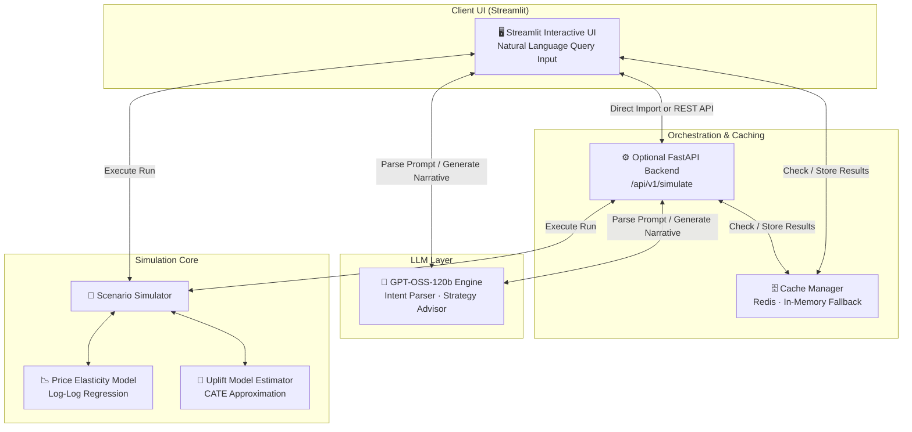

<div align="center">

<br/>

# 🔮 BizSim-AI

### AI-Powered Business Experimentation & Decision Simulator

<br/>

[](https://www.python.org/)
[](https://streamlit.io)
[](https://fastapi.tiangolo.com)
[](https://redis.io)
[](LICENSE)

<br/>

> *"What happens to our revenue and customer churn if we increase prices by 8% in Mumbai next quarter?"*

**BizSim-AI** combines **causal inference**, **econometric modeling**, and **Generative AI** to answer critical counterfactual business questions — *before* you commit capital.

<br/>

[**Quick Start**](#-setup--running) · [**Architecture**](#-system-architecture) · [**Data Science**](#-data-science--causal-core) · [**Tech Stack**](#%EF%B8%8F-tech-stack)

<br/>

</div>

---

## ✨ What Makes This Different

Most analytics tools look *backward* at historical data. BizSim-AI lets executives, product managers, and growth analysts simulate **future states** in real time.

| Capability | Description |
|---|---|
| 🧠 **Natural Language Interface** | Type a business question; the LLM parses your intent into a structured simulation |
| 📊 **Causal Econometrics** | Log-log price elasticity and uplift modeling — not just correlations |
| ⚡ **Intelligent Caching** | Redis-backed simulation cache with graceful in-memory fallback |
| 📝 **Executive Narrative Reports** | AI-generated Markdown advisory reports from raw simulation output |
| 🔌 **Dual Run Modes** | Standalone Streamlit *or* full decoupled FastAPI + Redis architecture |

---

## 🎨 System Architecture

BizSim-AI supports two deployment modes to showcase versatility:

- **Standalone Mode** — runs entirely within Streamlit; ideal for quick demos and Streamlit Sharing
- **Client-Server Mode** — decoupled FastAPI backend with Redis caching to demonstrate REST API design and high-performance serialization



### 🔄 The Executive Query Lifecycle


---

## 🧠 Data Science & Causal Core

The simulator models counterfactuals using solid econometric principles.

### 1 · Price Elasticity of Demand (PED)

Volume contraction from price changes is estimated via a **log-log demand regression**:

$$\ln(\text{demand}) = \alpha + \beta \ln(\text{price}) + \gamma X + \varepsilon$$

Where $\beta$ is the **Price Elasticity of Demand** coefficient:

| City | β (PED) | Effect of an 8% Price Increase |
|---|---|---|
| 🟠 Mumbai | −1.4 | −11.2% volume drop |
| 🟢 Delhi | −1.2 | More inelastic; smaller contraction |
| 🔴 Bangalore | −1.6 | Highly price-sensitive market |

### 2 · Uplift Modeling & Churn (CATE)

For discount campaigns, the simulator estimates **Conditional Average Treatment Effects** at the customer segment level:

$$\tau(x) = \mathbb{E}[Y(1) - Y(0) \mid X=x]$$

Customer cohorts are automatically segmented:

- **Persuadables** — churn probability drops significantly when treated with a discount
- **Do-Not-Disturbs** — premium users who respond negatively to promotional outreach, increasing churn risk slightly

---

## ⚡ Caching Strategy

Simulations and LLM narrative generations are computationally expensive. BizSim-AI implements a **deterministic, tiered caching strategy**:

```
Request Parameters  →  MD5 Hash  →  Cache Key: sim:hash:<hash>
                                          ↓
                              ┌─── Redis (TTL: 24h) ───┐
                              │  (if running locally    │
                              │   or via Docker)        │
                              └─────────────────────────┘
                                          ↓ fallback
                              ┌─── Streamlit In-Memory ─┐
                              │  (@st.cache_data)        │
                              │  Zero-setup, always on  │
                              └─────────────────────────┘
```

If Redis is unavailable, the app switches to Streamlit's in-memory cache automatically — no configuration required.

---

## 🛠️ Tech Stack

| Layer | Technology |
|---|---|
| **Frontend** | Streamlit · Plotly · Custom HSL Styling |
| **API Backend** | FastAPI · Uvicorn · Pydantic |
| **Data & Analytics** | Pandas · NumPy |
| **Caching** | Redis · Python dict fallback |
| **LLM Orchestration** | GPT-OSS-120b (OpenAI-compatible API) |

---

## 📁 Project Structure

```
ai-business-simulator/
│
├── 📄 docker-compose.yml          # Optional: Redis container setup
├── 📄 requirements.txt            # Python dependencies
├── 📄 .env.example                # Configuration template (LLM & Redis)
│
├── 📂 data/
│   └── synthetic/                 # Generated sales & customer CRM datasets
│
└── 📂 src/
    ├── 📂 data/
    │   └── synthetic_generator.py # Generates base datasets with hidden causal rules
    │
    ├── 📂 models/
    │   └── scenario_simulator.py  # Econometric & simulation math engine
    │
    ├── 📂 genai/
    │   └── llm_client.py          # GPT-OSS-120b client (with mock fallback)
    │
    ├── 📂 utils/
    │   └── cache_manager.py       # Redis + in-memory fallback logic
    │
    └── 📂 app/
        └── streamlit_app.py       # Main unified Streamlit dashboard
```

---

## 🚀 Setup & Running

### Step 1 — Clone & Install

```bash
git clone https://github.com/your-username/ai-business-simulator.git
cd ai-business-simulator
pip install -r requirements.txt
```

### Step 2 — Configure Environment

Copy `.env.example` to `.env` and fill in your credentials:

```env
# GPT-OSS-120b API (OpenAI-compatible)
LLM_API_URL=https://api.gpt-oss-120b.example.com/v1
LLM_API_KEY=your_api_key_here

# Redis (optional — defaults to localhost)
REDIS_HOST=localhost
REDIS_PORT=6379
```

> **No API key?** The app automatically runs in **Mock LLM Mode** using heuristic template rules — no setup needed for reviewers.

### Step 3 — Run

**Option A · Standalone (Single Command)**

```bash
streamlit run app/streamlit_app.py
```

The app auto-checks for datasets, runs the synthetic generator if missing, and launches the UI.

**Option B · Client-Server (Full API + Redis)**

```bash
# 1. Start Redis
docker-compose up -d redis

# 2. Start FastAPI backend
uvicorn src.api.main:app --host 0.0.0.0 --port 8000

# 3. Start Streamlit dashboard
streamlit run app/streamlit_app.py -- --use-api
```

---

## 📈 Evaluation Metrics

| Model | Metric | Target | Description |
|---|---|---|---|
| **Causal Impact** | MAPE | < 10.0% | Synthetic control group accuracy |
| **Uplift Model** | Qini Coefficient | > 0.15 | Targeted voucher cohort separation |
| **Price Elasticity** | R² | > 0.80 | Log-log demand curve regression fit |

---

## 🔮 LLM Orchestration

The LLM is prompted with **structured JSON interfaces** to minimise hallucination. Two prompts power the core workflow:

**Intent Parser** — converts natural language business queries into structured simulation parameters.

**Strategic Advisor** — receives raw simulation output and generates a professional, Markdown-formatted executive advisory report.

---

<div align="center">

<br/>

*Developed as a portfolio project showcasing modern causal AI and LLM integration.*

<br/>

**[⬆ Back to top](#-bizsim-ai)**

</div>
