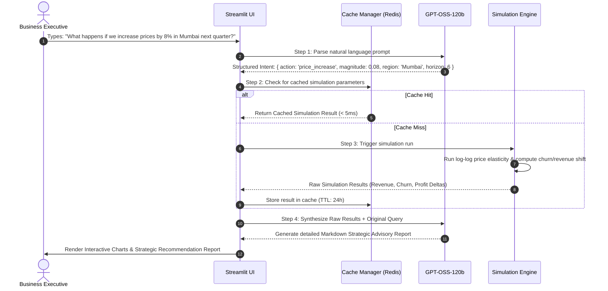

# 🔮 BizSim-AI: AI-Powered Business Experimentation & Decision Simulator

[](https://www.python.org/)
[](https://streamlit.io)
[](https://fastapi.tiangolo.com)
[](https://redis.io)
[](https://github.com)

**BizSim-AI** is a decision-support dashboard designed for portfolios and resumes. It showcases how to combine **causal inference**, **econometric modeling**, and **Generative AI (GPT-OSS-120b)** to answer critical counterfactual business questions: 

> *"What happens to our revenue and customer churn if we increase prices by 8% in Mumbai next quarter?"*

Rather than looking backward at historical sales, BizSim-AI allows executives, product managers, and growth analysts to simulate future states *before* committing capital. It translates natural language business queries into structured simulations, calculates elasticity and uplift, and generates a dynamic executive narrative report.

---

## 🎨 System Architecture

BizSim-AI is structured as a **single cohesive project** that is easy to deploy. It supports two run modes to showcase versatility:
1. **Standalone Mode (Easiest)**: Runs entirely within Streamlit. Ideal for quick deployment, local runs, or web hosting (e.g., Streamlit Sharing).
2. **Client-Server Mode (Full API)**: Uses a decoupled FastAPI backend with a Redis caching layer to demonstrate REST API design, serialization, and high-performance caching.

```mermaid
flowchart TD
    subgraph Client UI (Streamlit)
        UI["Streamlit Interactive UI\n(Natural Language Query Input)"]
    end

    subgraph Orchestration & Caching
        API["Optional FastAPI Backend\n(/api/v1/simulate)"]
        CacheManager["Cache Manager\n(Redis Cache with In-Memory Fallback)"]
    end

    subgraph LLM Layer
        LLM["GPT-OSS-120b Engine\n(Intent Parser & Strategy Advisor)"]
    end

    subgraph Simulation Core
        Sim["Scenario Simulator"]
        Elasticity["Price Elasticity Model\n(Log-Log Regression)"]
        Uplift["Uplift Model Estimator\n(CATE Approximation)"]
    end

    UI <--> |Direct Import or REST API| API
    API & UI <--> |Check / Store Results| CacheManager
    API & UI <--> |Parse Prompt / Generate Narrative| LLM
    API & UI <--> |Execute Run| Sim
    
    Sim <--> Elasticity
    Sim <--> Uplift
```

### 🔄 The Executive Query Lifecycle



---

## 🧠 Data Science & Causal Core

The simulator models counterfactuals using solid econometric principles:

### 1. Price Elasticity of Demand (PED)
We calculate the volume contraction resulting from price changes using a log-log demand regression model:
$$\ln(\text{demand}) = \alpha + \beta \ln(\text{price}) + \gamma X + \varepsilon$$

Where $\beta$ represents the **Price Elasticity of Demand (PED)** coefficient. 
- **Mumbai ($\beta = -1.4$)**: An $8\%$ price increase leads to an $11.2\%$ drop in volume.
- **Delhi ($\beta = -1.2$)**: A more inelastic market.
- **Bangalore ($\beta = -1.6$)**: Highly price-sensitive.

### 2. Uplift Modeling & Churn (CATE)
For discount campaigns, we simulate individual and segment-level treatment effects. The simulator estimates the **Conditional Average Treatment Effect (CATE)**:
$$\tau(x) = \mathbb{E}[Y(1) - Y(0) \mid X=x]$$

Using customer attributes, it segments the cohort:
* **Persuadables**: Churn probability drops significantly when treated with a discount.
* **Do-Not-Disturbs**: Premium users who get annoyed by promotional spam, increasing their churn probability slightly.

---

## ⚡ Caching Strategy (Redis & In-Memory)

Simulations and LLM narrative generations are computationally heavy. To handle recurring user queries, BizSim-AI implements a deterministic caching strategy:
1. **Key Generation**: Simulation parameters are hashed using MD5 to create a unique key: `sim:hash:<request_hash>`.
2. **Redis Integration**: If Redis is running locally or in Docker, the app caches results with a **24-hour Time-To-Live (TTL)**.
3. **Graceful Fallback**: If Redis is not running, the application switches to **Streamlit In-Memory caching** (`@st.cache_data`) automatically, ensuring a zero-setup startup for reviewers.

---

## 🛠️ Tech Stack

- **Frontend**: Streamlit (Rich UI, interactive charts, custom HSL styling)
- **API Backend**: FastAPI, Uvicorn, Pydantic
- **Data & Analytics**: Pandas, NumPy, Plotly
- **Caching**: Redis (with a Python dictionary fallback)
- **LLM Orchestration**: GPT-OSS-120b (exposes an OpenAI-compatible API)

---

## 📁 Project Structure

```
ai-business-simulator/
│
├── docker-compose.yml          # Optional: Redis container setup
├── requirements.txt            # Python packages
├── .env.example                # Configuration template (LLM & Redis)
│
├── data/
│   └── synthetic/              # Generated sales & customer CRM datasets
│
├── src/
│   ├── __init__.py
│   ├── data/
│   │   └── synthetic_generator.py # Generates base datasets with hidden causal rules
│   │
│   ├── models/
│   │   └── scenario_simulator.py  # Econometric & simulation math engine
│   │
│   ├── genai/
│   │   └── llm_client.py          # Interfacing with GPT-OSS-120b (with mock fallback)
│   │
│   └── utils/
│       └── cache_manager.py       # Redis caching logic + in-memory fallback
│
└── app/
    └── streamlit_app.py        # Main unified Streamlit dashboard application
```

---

## 🚀 Setup & Running the Simulator

### Step 1: Clone and Install Dependencies
```bash
git clone https://github.com/your-username/ai-business-simulator.git
cd ai-business-simulator
pip install -r requirements.txt
```

### Step 2: Configure Environment Variables
Create a `.env` file in the root directory:
```env
# GPT-OSS-120b API Configuration (OpenAI Compatible)
LLM_API_URL=https://api.gpt-oss-120b.example.com/v1
LLM_API_KEY=your_api_key_here

# Redis Cache Config (Optional, defaults to localhost)
REDIS_HOST=localhost
REDIS_PORT=6379
```
*Note: If no API key is provided, the application will automatically run in **Mock LLM Mode** using heuristic template rules, allowing immediate testing.*

### Step 3: Run the Application

#### Option A: Standalone Mode (Single Command)
This launches the app directly without needing to start a separate API backend:
```bash
streamlit run app/streamlit_app.py
```
*(The app will automatically check for datasets, run the synthetic generator if missing, and launch the interface).*

#### Option B: Client-Server Mode (With API & Redis)
1. **Boot Redis**:
   ```bash
   docker-compose up -d redis
   ```
2. **Start FastAPI Backend**:
   ```bash
   uvicorn src.api.main:app --host 0.0.0.0 --port 8000
   ```
3. **Start Streamlit Dashboard**:
   ```bash
   streamlit run app/streamlit_app.py -- --use-api
   ```

---

## 📈 Evaluation Metrics

To validate our models under the hood:

| Model / Concept | Metric | Target | Description |
|---|---|---|---|
| **Causal Impact** | MAPE | $< 10.0\%$ | Validation of synthetic control group accuracy |
| **Uplift Model** | Qini Coeff | $> 0.15$ | Success in targeted voucher cohort separation |
| **Price Elasticity** | $R^2$ | $> 0.80$ | Regression fit of log-log demand curve |

---

## 🧠 LLM Orchestration (GPT-OSS-120b)

The LLM is prompted with structured JSON interfaces to prevent hallucination:

```python
# System prompt snippet for Intent Parsing:
SYSTEM_PROMPT = """
You are an NLP parser. Convert the user's business simulation query into a valid JSON object.
JSON keys: "action" (must be "price_increase" or "discount_campaign"), 
"magnitude" (float, e.g. 0.08 for 8%), "region" ("Mumbai", "Delhi", "Bangalore"),
"horizon_months" (integer, default 6).
"""
```

It is also used to generate the final advisory report by receiving the raw simulation output and writing executive summaries:
```python
# Prompt snippet for Strategic Advisor:
ADVISORY_PROMPT = f"""
Analyze this simulation result: {{simulation_results}}
For the user's query: "{{user_query}}"
Generate a professional, markdown-formatted business advisory report.
"""
```

---
*Developed as a portfolio project showcasing modern causal AI and LLM integration.*
